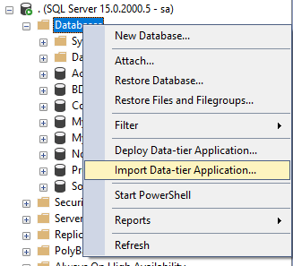
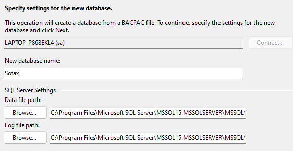
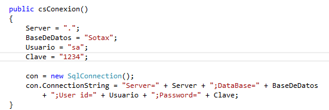
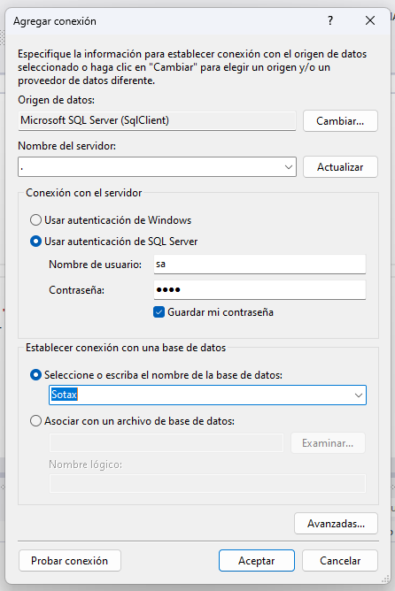

  
  <h1 align="center">Sotax</h1>

Software de escritorio para la administracion de los ingresos de una cooperativa de Taxis.

## Requisitos para la ejecución
- El proyecto está realizado en Visual Studio 2012, se puede usar versiones posteriores pero hay que tener en cuenta los reportes ya que están creados con "Report Viewer" y desde la versión de Visual Studio 2019 hay que instalarlo como complemento. 
- La base de datos fue creada en SQL Server 2019 hasta el momento con las actualizacion sigue funcionando el archivo ".bacpac".

## Instalación de la base de datos en SQL Server 2019
- Descargar el archivo "Sotax.bacpac"
- En SQL Server dar click derecho en "databases" y entrar a la opción "Import Data-tier Application.."

- Seleccionar la ruta donde se encuentra el archivo ".bacpac".
- En el nombre de la base de datos se debe colocar "Sotax" para evitar confusiones con la clase "conexion.cs" que se encuentra en el proyecto.

- Ahora solo toca esperar que termine de cargar la base de datos.
- Este archivo ".bacpac" contiene toda la base de datos, esto quiere decir que contiene los datos que se han registrado, triggers, funciones, procedicimientos almacenados, entre otras cosas.

## Configurar la conexión entre C# y SQL Server
- Dentro del proyecto existe una clase con el nombre de "csConexion.cs" hay que editar esa clase para establecer la conexión con la base de datos.
- Lo que se debe editar es el constructor de esta clase, se tiene que escribir los datos correspondientes a su usuario y servidor de SQL Server

- También se debe editar la conexion del proyecto, para ello hay que dirigirse a "Jerramientas" y dar click en la opción "conectar con base de datos".

- Y completar el formulario con los datos correspondientes a la conexión con la base de datos.

- Una vez realizado los cambios se puede ejecutar el proyecto y hacer uso de la base de datos.

