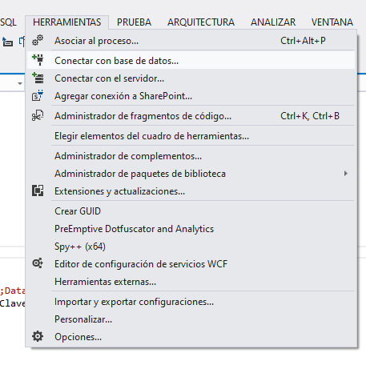
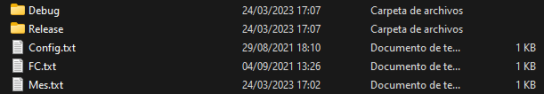
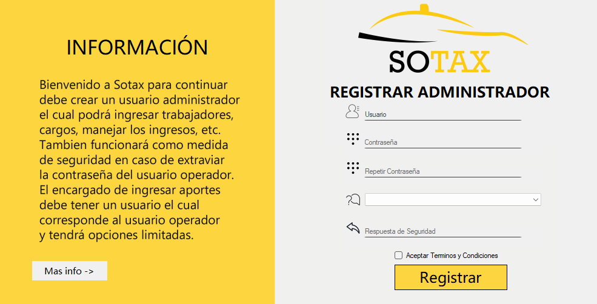
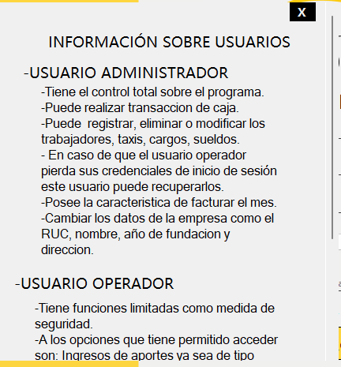
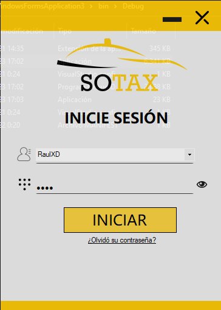
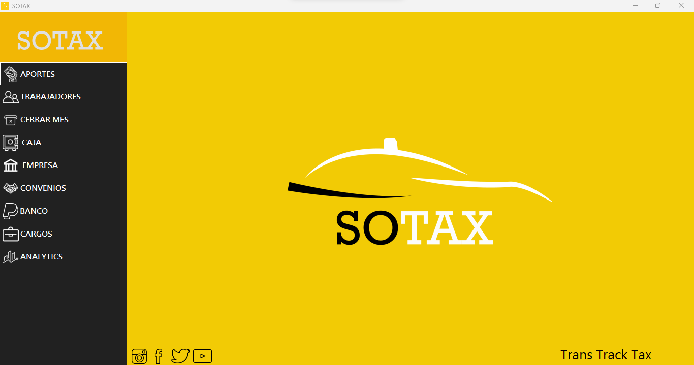
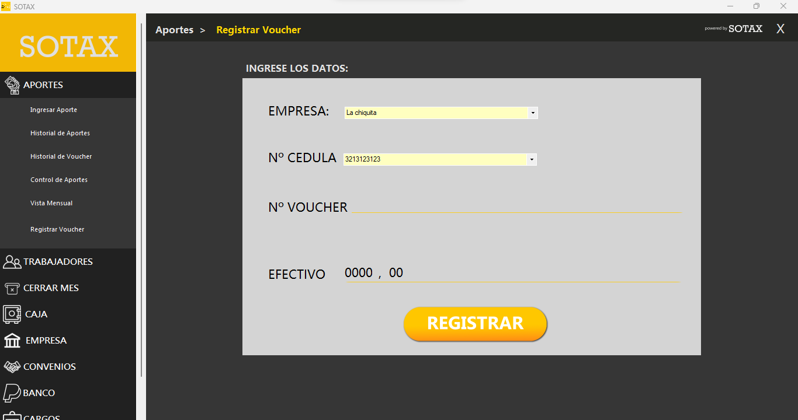
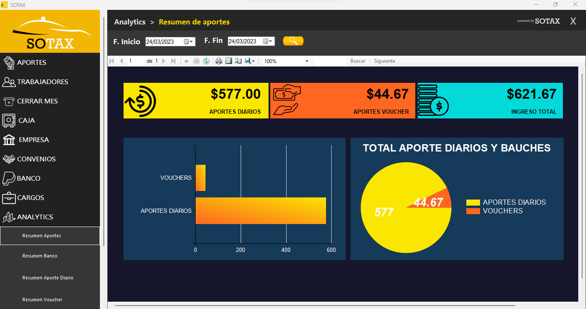

  
  <h1 align="center">Sotax</h1>

Software de escritorio para la administracion de los ingresos de una cooperativa de Taxis.

## Requisitos para la ejecución
- El proyecto está realizado en Visual Studio 2012, se puede usar versiones posteriores pero hay que tener en cuenta los reportes ya que están creados con "Report Viewer" y desde la versión de Visual Studio 2019 hay que instalarlo como complemento. 
- La base de datos fue creada en SQL Server 2019 hasta el momento con las actualizacion sigue funcionando el archivo ".bacpac".

## Instalación de la base de datos en SQL Server 2019
- Descargar el archivo "Sotax.bacpac"
- En SQL Server dar click derecho en "databases" y entrar a la opción "Import Data-tier Application.."

- Seleccionar la ruta donde se encuentra el archivo ".bacpac".
- En el nombre de la base de datos se debe colocar "Sotax" para evitar confusiones con la clase "conexion.cs" que se encuentra en el proyecto.

- Ahora solo toca esperar que termine de cargar la base de datos.
- Este archivo ".bacpac" contiene toda la base de datos, esto quiere decir que contiene los datos que se han registrado, triggers, funciones, procedicimientos almacenados, entre otras cosas.

## Configurar la conexión entre C# y SQL Server
- Dentro del proyecto existe una clase con el nombre de "csConexion.cs" hay que editar esa clase para establecer la conexión con la base de datos.
- Lo que se debe editar es el constructor de esta clase, se tiene que escribir los datos correspondientes a su usuario y servidor de SQL Server

- También se debe editar la conexion del proyecto, para ello hay que dirigirse a "Jerramientas" y dar click en la opción "conectar con base de datos".

- Y completar el formulario con los datos correspondientes a la conexión con la base de datos.

- Una vez realizado los cambios se puede ejecutar el proyecto y hacer uso de la base de datos.

## Manejo de archivos del proyecto 
Dentro del proyecto en la carpeta "bin" están alojados 3 documentos de texto los cuales pueden ser cambiados a ".dll" e incriptarlos pero de momento están de esta manera para manipularlos y hacer pruebas. 

Uno de los archivos más importantes es el que lleva por nombre "Config.txt" ya que este se encarga de verificar si el programa se ha ejecutado por primera vez, de ser el caso inicia una ventana de primera configuracion del programa en el cual se debe ingresar un superusario con el cual se podrán crear más usuarios y darles roles y permisos. En las capturas del proyecto se ve más a detalle las configuraciones del proyecto.

## Capturas de pantalla del software Sotax
- Al iniciar el programa por primera vez aparecerá la siguiente pantalla de configuracion en el cuál se debe registrar un usuario administrador que servirá para crear los demás usuarios y roles.

- Si da click en el botón de "Más info" aparecerá una ventana con la informacion sobre los usuarios, roles y opciones a las que puede acceder cada uno.

- El inicio de sesión es algo que siempre se mostrará despues de haber terminado la primer configuración.

- Este es el menú principal con todas las opciones que están disponibles en el software.

- Una de las ventanas de registro de ingresos a la cooperativa de taxis: 

-También genera gráficos estadísticos para la toma de deciciones: 

## Anotaciones 
- Por el momento esto solo es un pequeño resumen de lo que hace el software, pronto actualizaré el repositorio y añadiré la documentación completa en un pdf con los requerimientos y los diagramas de casos de uso, clase, actividades, etc. 
- Tener en cuenta que este fué el primer proyecto que realizé en mi carrera como desarrollador por lo que la base de datos y algunas cosas están muy primitivas y tienen algunos fallos.

